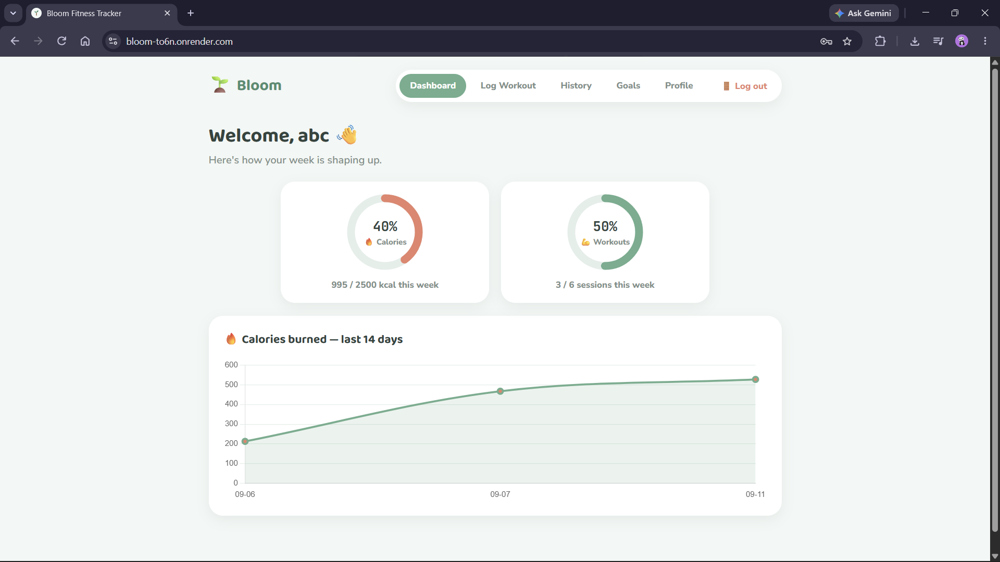
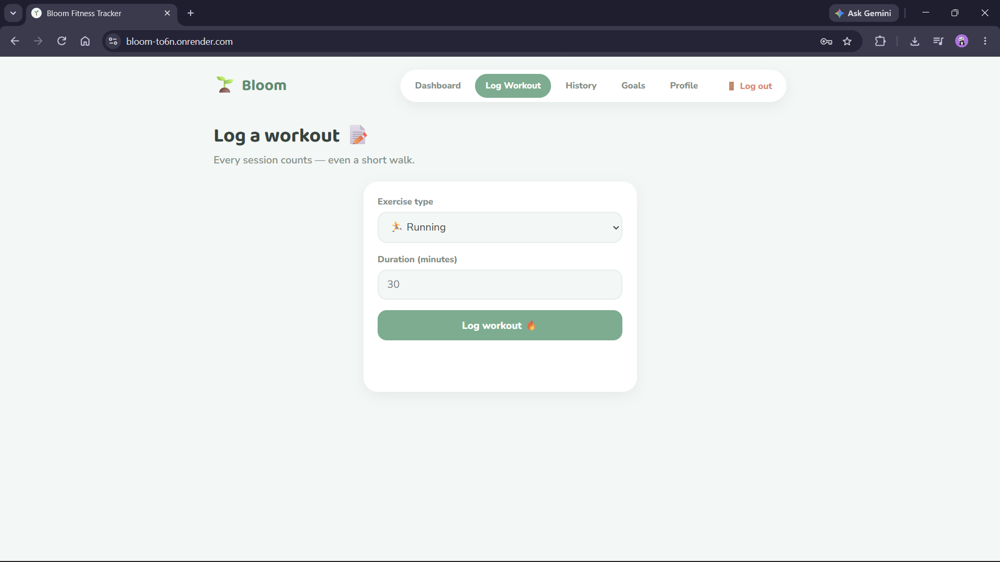
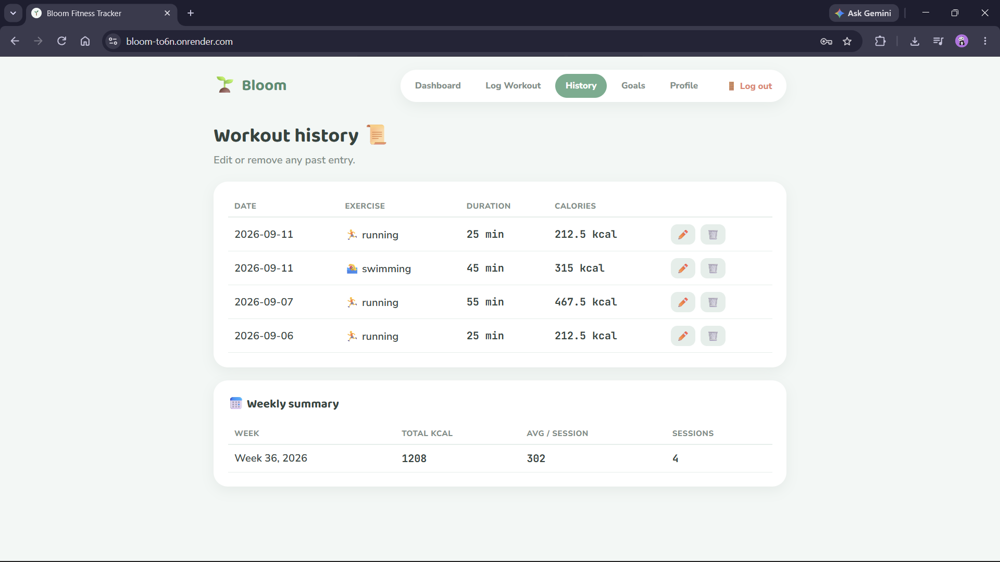
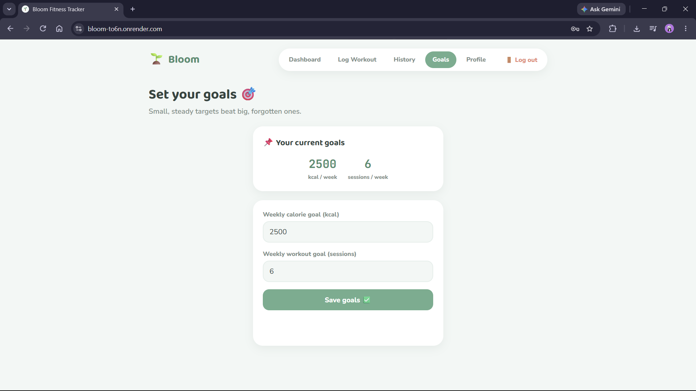
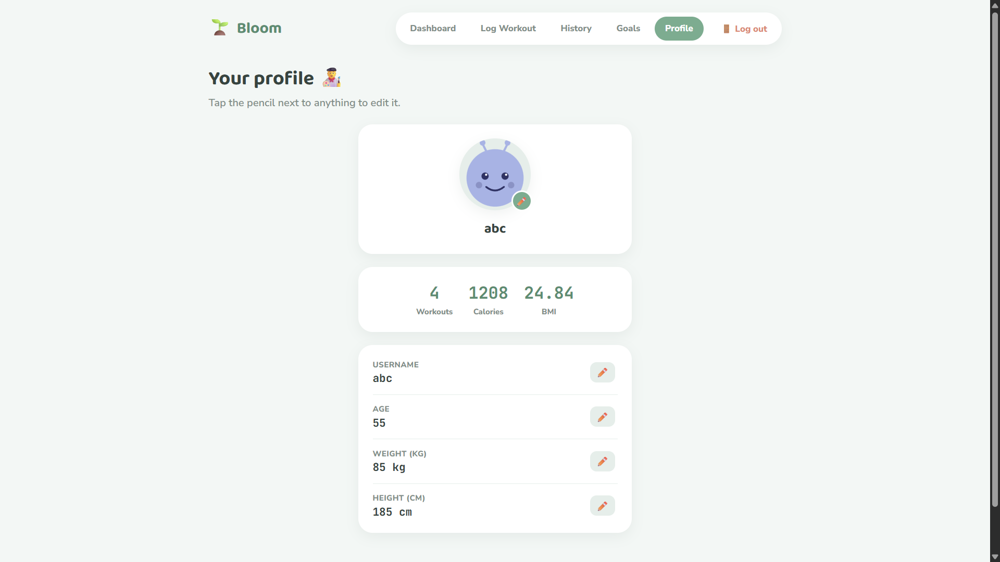
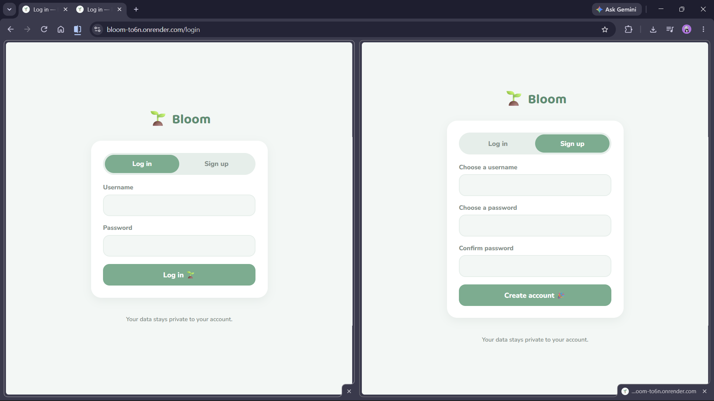

# 🌱 Bloom — Fitness Tracker

A full-stack fitness tracker built with Flask, MongoDB, and vanilla JavaScript — turning a simple command-line workout logger into a deployed, multi-user web app with charts, goal tracking, and a playful pastel design.

**🔗 Live demo:** [bloom-to6n.onrender.com](https://bloom-to6n.onrender.com)

> Note: the live demo is hosted on Render's free tier, so it may take 30–60 seconds to wake up if it hasn't been visited recently.

---


**Dashboard** — progress rings and a 14-day calorie trend


**Log a workout**


**Workout history** — editable and deletable entries


**Goals**


**Profile** — pick an avatar, inline-editable details


**Login / Sign up**


---

## ✨ Features

- **Accounts & private data** — sign up, log in, and every user's workouts, goals, and profile are private to their own account
- **Dashboard** — animated progress rings for weekly calorie and workout goals, plus a line chart of calories burned over the last 14 days
- **Log workouts** — pick an exercise and duration; calories are calculated automatically
- **Editable history** — edit or delete any past workout entry, plus a weekly summary table
- **Goal tracking** — set weekly calorie and workout targets, see progress live on the dashboard
- **Profile** — pick from a set of avatar images, inline-edit your username/age/weight/height, and see lifetime stats (total workouts, total calories, BMI)
- **Responsive design** — collapsible mobile navigation, scrollable tables, and a layout that adapts down to phone-sized screens. Works smoothly on mobile browsers, not just desktop.
- **Playful, pastel UI** — rounded cards, soft colors, and small animated details (waving hand, filling progress rings)

## 🛠️ Tech stack

| Layer | Tool | Why |
|---|---|---|
| Backend | **Flask** (Python) | Small, beginner-friendly web framework |
| Database | **MongoDB** (via `pymongo`), hosted on **MongoDB Atlas** | Document database, free managed hosting tier |
| Frontend | **Plain HTML / CSS / JavaScript** | No build step, no framework — every file is directly readable |
| Charts | **Chart.js** | Hosted locally in the project (not a CDN), so it never depends on external network access |
| Auth | Flask sessions + `werkzeug.security` password hashing | No plaintext passwords stored, ever |
| Deployment | **Render** (Gunicorn as the production server) | Free tier, auto-deploys from GitHub |

## 🚀 Running it locally

**1. Clone the repo:**
```bash
git clone https://github.com/yourusername/bloom.git
cd bloom
```

**2. Create a virtual environment and install dependencies:**
```bash
python -m venv venv
source venv/bin/activate      # Windows: venv\Scripts\activate
pip install -r requirements.txt
```

**3. Set up environment variables.** Create a file called `.env` in the project root:
```
SECRET_KEY=generate-a-random-string-here
MONGO_URI=mongodb://localhost:27017/
FLASK_DEBUG=True
```
Generate a random secret key with:
```bash
python -c "import secrets; print(secrets.token_hex(32))"
```

**4. Make sure MongoDB is running locally** (or point `MONGO_URI` at a MongoDB Atlas cluster instead).

**5. Run the app:**
```bash
python app.py
```
Visit `http://localhost:5000` in your browser.

## 📁 Project structure

```
bloom/
├── app.py                     # Flask backend: routes, auth, MongoDB logic
├── requirements.txt           # Python dependencies
├── Procfile                   # Tells Render/Heroku how to start the app in production
├── .env                       # Local secrets (never committed — see .gitignore)
├── templates/
│   ├── index.html             # Main app (all tabs: dashboard, log, history, goals, profile)
│   ├── login.html             # Login / sign up page
│   ├── 404.html               # Custom "page not found" page
│   └── 500.html               # Custom "something went wrong" page
└── static/
    ├── css/style.css          # All styling
    ├── js/app.js               # Frontend logic (tabs, API calls, charts, inline editing)
    ├── js/vendor/chart.umd.js  # Chart.js, hosted locally rather than via CDN
    └── img/
        ├── favicon.svg
        └── avatars/            # 8 selectable profile avatar images
```

## 🔒 Security notes

- Passwords are hashed with `werkzeug.security` — never stored in plain text
- CSRF protection on login/signup forms via Flask-WTF
- All API routes require an authenticated session; each user's data is scoped by `user_id` at the database level
- Secrets (session key, database URL) are loaded from environment variables, never hardcoded
- MongoDB indexes enforce unique usernames and speed up per-user queries

## 🗺️ Possible future additions

- Password reset flow
- Exercise-type breakdown chart (pie/donut)
- Rate limiting on login attempts
- Dark mode

---

Originally started as a simple command-line MongoDB fitness tracker in Python, rebuilt step by step into a full multi-user web application.
